# Hardware

---

  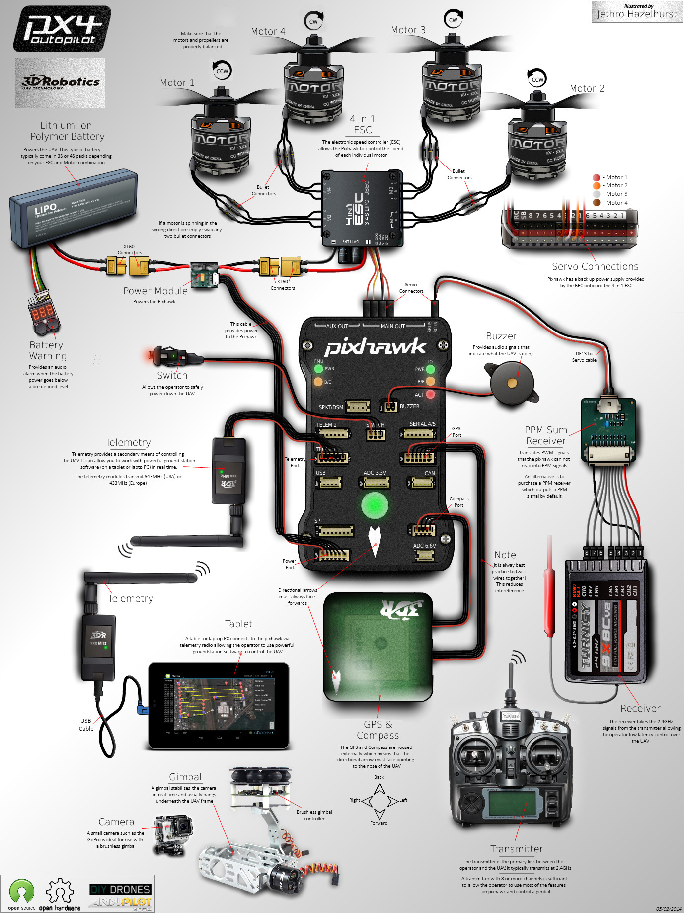

## 硬件说明

### 机架

* F450

* 机臂 和 脚架

### 电源

* 电池: 动力锂电池

* BB响

* 底板 和 分电板

### 动力

* 郎宇 A2212 电机

* 电调

* 桨叶

### 飞控

* Pixhawk 4

* 减震板

### 传感器

* GPS
    * 安全开关
  
* IMU

### 通信

#### 遥控器 和 接收机

* 乐迪 AT9S 遥控器

* 接收机: R9DS

#### 数传电台

* XROCK 无线数传电台模块
* V4具有可互换功能，可作为地面端，又可作为机载端使用
* APM / Pixhawk4 / PIX2.4.8

  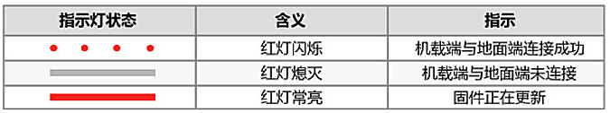

  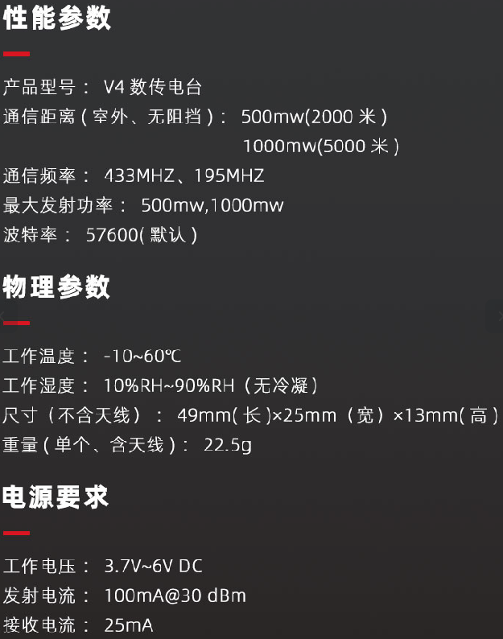
  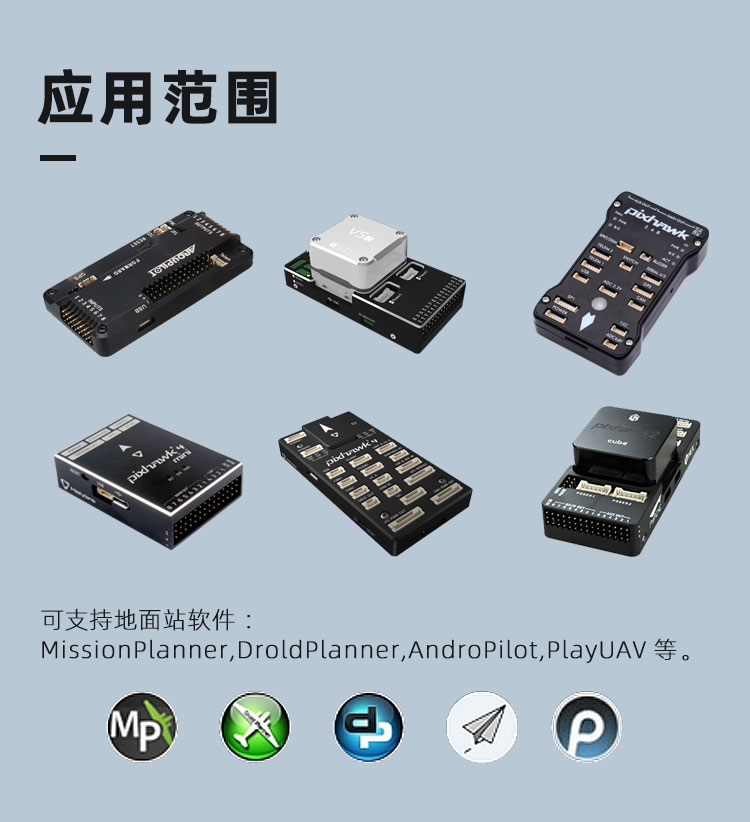

## 硬件组装

  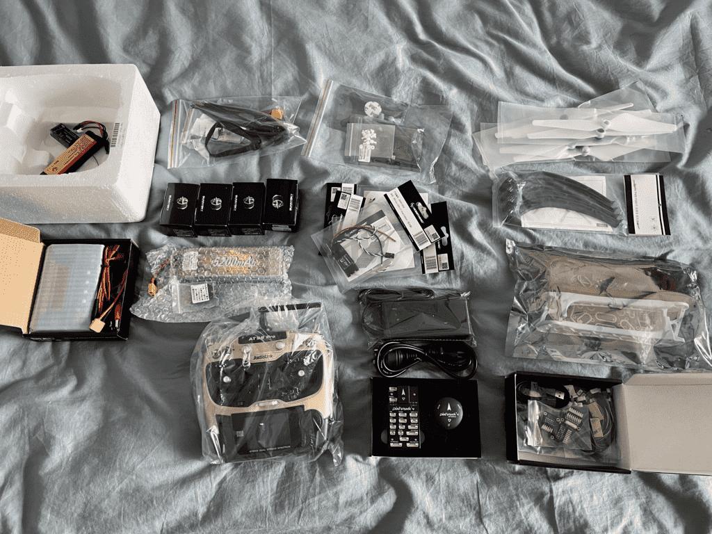

焊接 底板和电调

  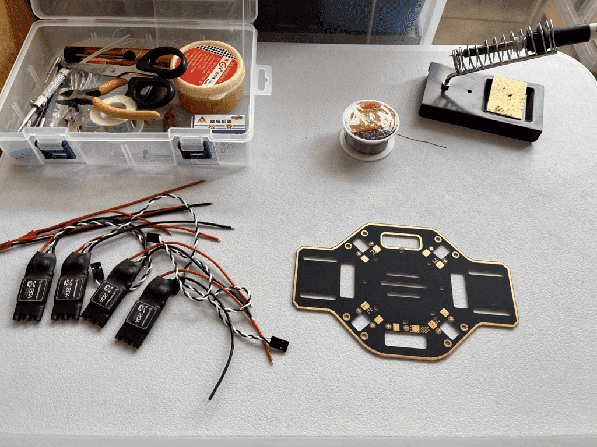

  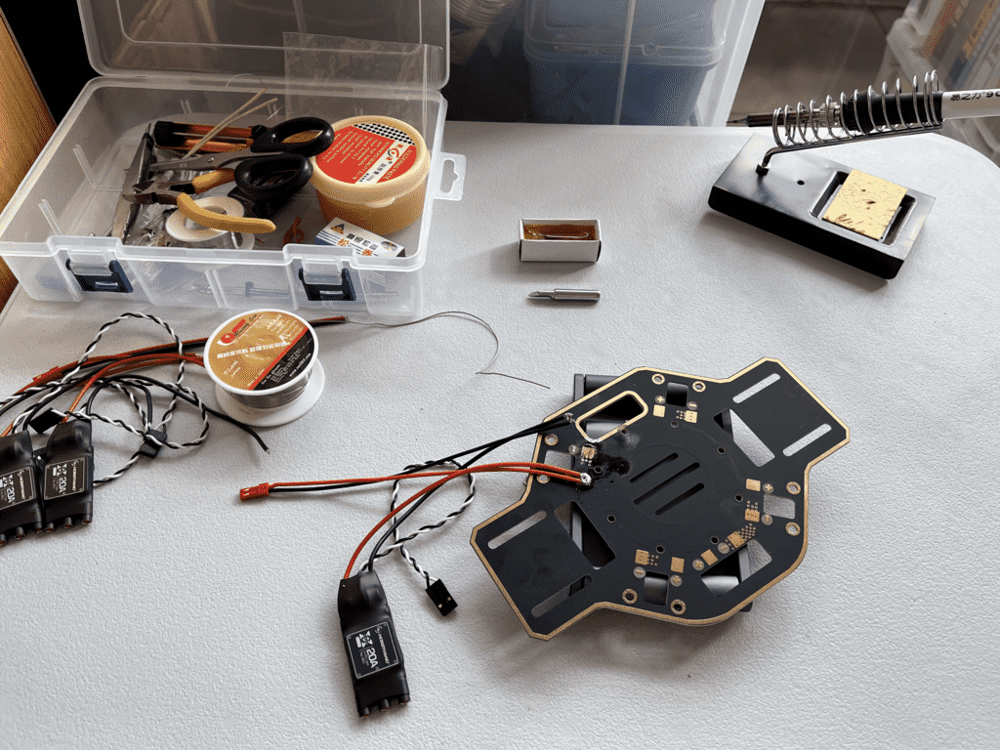

  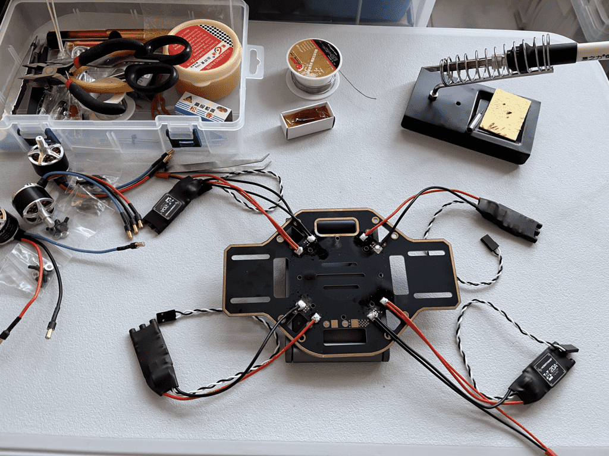

安装4个电机

  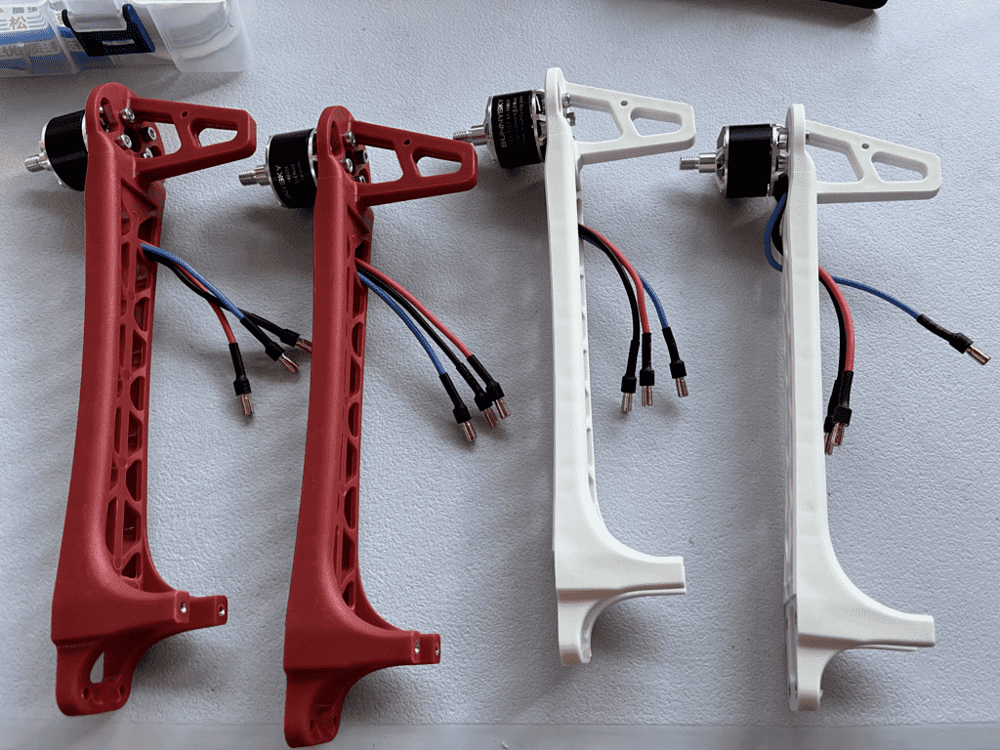

电机与电调接线 (注意顺序)，安装 机臂

  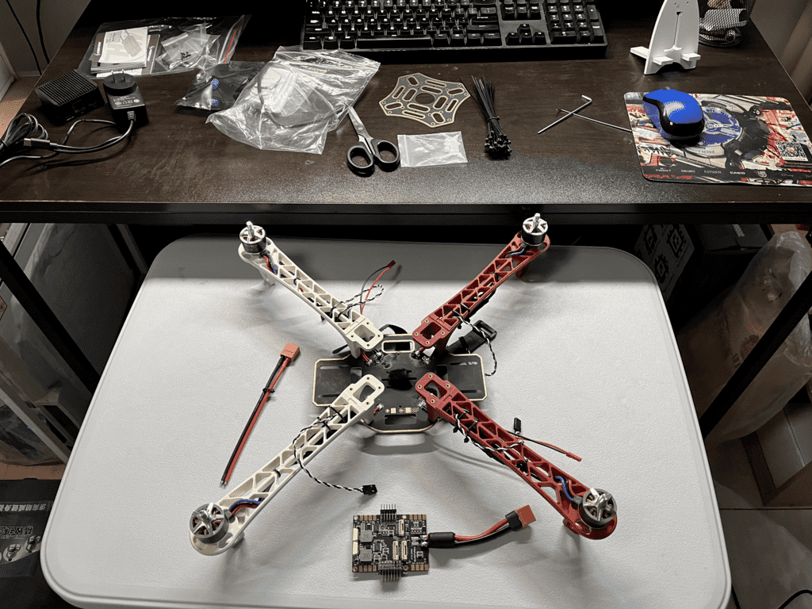

焊接 分电板和底板，并安装 (此步骤应该在安装机臂前)

  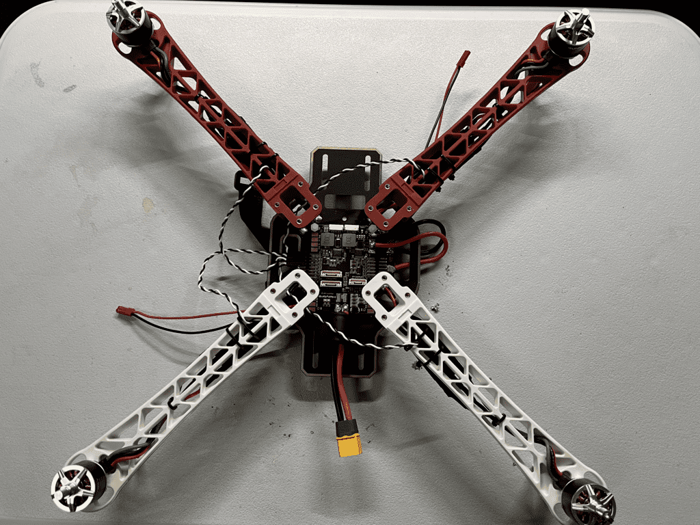

安装 减震板、飞控、GPS、脚架

  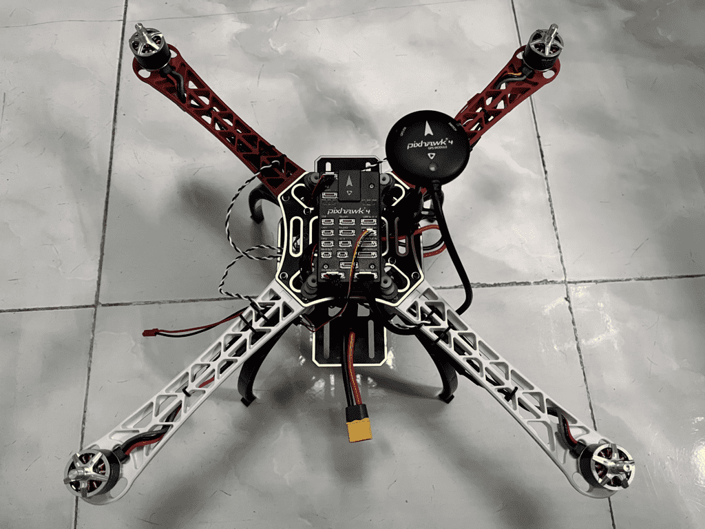

  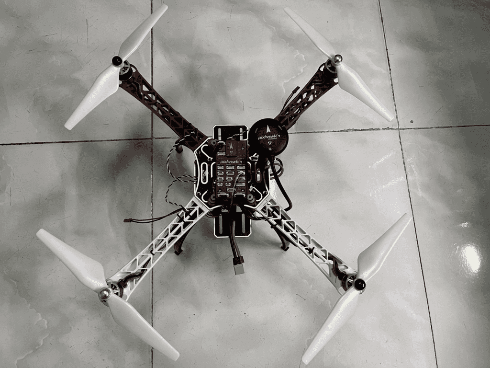

