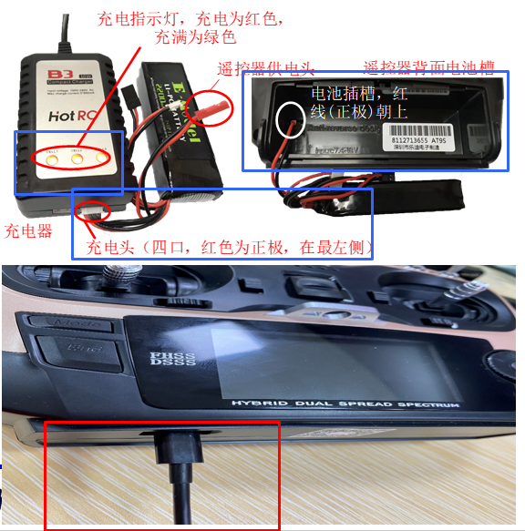

# Hardware

---

  

## 硬件说明

### 机架

* F450

* 机臂 和 脚架

### 电源

* 电池: 动力锂电池

* BB响

* 底板 和 分电板

### 动力

* 郎宇 A2212 电机：无刷电机

* 电调

* 桨叶：10寸浆（25厘米左右）

### 飞控

- Pixhawk 4

- 减震板

#### Pixhawk 4

### 传感器

* GPS
    * 安全开关
  
* IMU

### 通信

#### 遥控器 和 接收机

https://www.radiolink.com/at9spro_manual

* 乐迪 AT9S Pro 遥控器

* 接收机: R9DS

##### 电池安装

遥控器电池安装方式为：打开遥控器后侧下方电池槽（向下推即可），将电池供电头（红色接口，有红黑两条电线对应正极和负极）插在遥控器的电池槽左侧二口排插上，保证正极（红色电线）朝上。

注：不要使用 USB端口作为充电端口，否则会损坏发射机，端口用于升级固件和将数据复制到计算机。它不能在计算机上用作控制器。

  

#### 数传电台

https://docs.px4.io/main/en/telemetry/

* XROCK 无线数传电台模块
* V4具有可互换功能，可作为地面端，又可作为机载端使用
* APM / Pixhawk4 / PIX2.4.8

  

  
  

软件配置：

- MP
- QGC
- 3DRRadio Config

## 硬件组装

  

焊接 底板和电调

  

  

  

安装4个电机

  

电机与电调接线 (注意顺序)，安装 机臂

  

焊接 分电板和底板，并安装 (此步骤应该在安装机臂前)

  

安装 减震板、飞控、GPS、脚架

  

  

